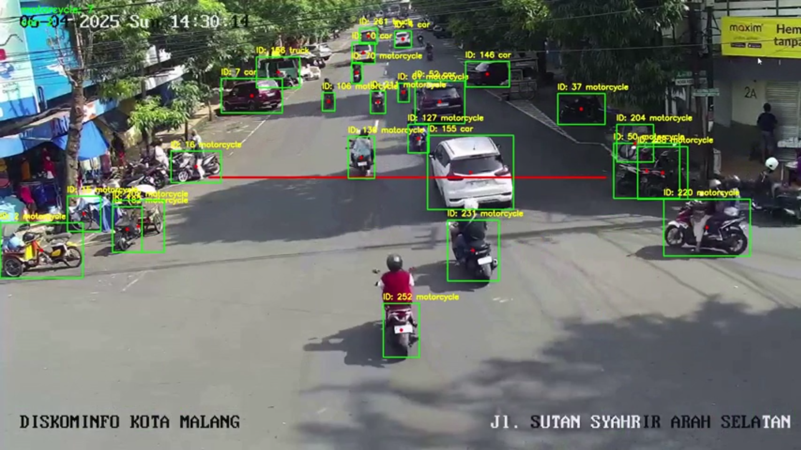

# YOLOv11 Vehicle Counting - Video & Live Stream

Proyek ini mengimplementasikan sistem pendeteksian dan penghitungan kendaraan berbasis YOLOv11. Aplikasi ini dapat mendeteksi dan menghitung kendaraan baik dari video yang diunggah maupun dari siaran langsung CCTV (stream URL).

---

## Deskripsi Dataset

Dataset utama bukan berasal dari sumber statis, melainkan dari:
- Video yang diunggah oleh pengguna melalui antarmuka web.
- URL live stream (misalnya RTSP) dari kamera CCTV.

Deteksi dilakukan menggunakan model YOLOv11 terlatih (`yolo11l.pt`) untuk mengenali kendaraan seperti mobil, motor, bus, dan truk.

---

## Pra-pemrosesan Data

- Setiap frame video dikonversi ke dalam array NumPy.
- Model YOLOv11 digunakan untuk mendeteksi objek pada setiap frame.
- Tracking ID digunakan untuk menghindari penghitungan ganda pada kendaraan yang sama.
- Kendaraan yang melewati garis deteksi horizontal dihitung dan dicatat bersama timestamp dan confidence.

---

## Arsitektur Model yang Digunakan

- **Model:** YOLOv11 (dimuat dari file `yolo11l.pt`)
- **Framework:** Ultralytics YOLO (PyTorch-based)
- **Kelas yang Dideteksi:** Mobil, Motor, Truk, Bus, dll (kelas 1, 2, 3, 5, 7)
- **Tracking:** Menggunakan fitur `track(persist=True)` dari Ultralytics untuk ID pelacakan per objek.

---

## Strategi Pelatihan

> Tidak dilakukan pelatihan dalam proyek ini. Model YOLOv11 yang digunakan adalah hasil pelatihan sebelumnya (pretrained model) yang dimuat langsung melalui:
```python
model = YOLO('yolo11l.pt')
```
Model ini sudah terlatih untuk mendeteksi kendaraan umum di lingkungan perkotaan.

---

## Evaluasi Model

Evaluasi dilakukan secara kuantitatif melalui:
- **Jumlah kendaraan yang dihitung secara otomatis.**
- **Confidence score tiap deteksi**, disimpan dalam file `.csv`.

File CSV berisi:
- Total kendaraan terdeteksi per jenis.
- Rincian individual: timestamp, ID kendaraan, tipe, confidence.

Contoh:

| Timestamp           | Vehicle ID | Vehicle Type | Confidence |
|---------------------|------------|---------------|-------------|
| 2025-05-01 12:00:02 | 17         | car           | 0.88        |

---

## 📊 Visualisasi Performa

- Hasil deteksi divisualisasikan langsung pada frame video:
  - Bounding box + label + ID
  - Garis merah sebagai batas deteksi
- Video hasil deteksi dapat diputar langsung di antarmuka web.
- Jumlah kendaraan per kelas ditampilkan dalam UI.

Contoh tangkapan layar visualisasi:

```

```

---

## 🌐 Antarmuka Web

- File HTML (`index.html`) menyediakan UI untuk:
  - Upload video dan memprosesnya.
  - Menampilkan hasil deteksi.
  - Mengunduh file CSV.
  - Deteksi kendaraan secara live dari stream.

---

## 📁 Struktur Proyek

```
├── main.py              # FastAPI backend
├── index.html           # UI frontend
├── uploads/             # Folder untuk video dan hasil deteksi
├── csv_data/            # Folder untuk menyimpan file CSV hasil deteksi
└── yolo11l.pt           # Model YOLO terlatih
```

---

## 🚀 Menjalankan Aplikasi

```bash
pip install fastapi uvicorn ultralytics opencv-python numpy
uvicorn main:app --reload --host 0.0.0.0 --port 8000
```

Akses UI di: [http://localhost:8000](http://localhost:8000)

---

## 📝 Lisensi

MIT License. Bebas digunakan untuk keperluan riset, pendidikan, dan non-komersial.
