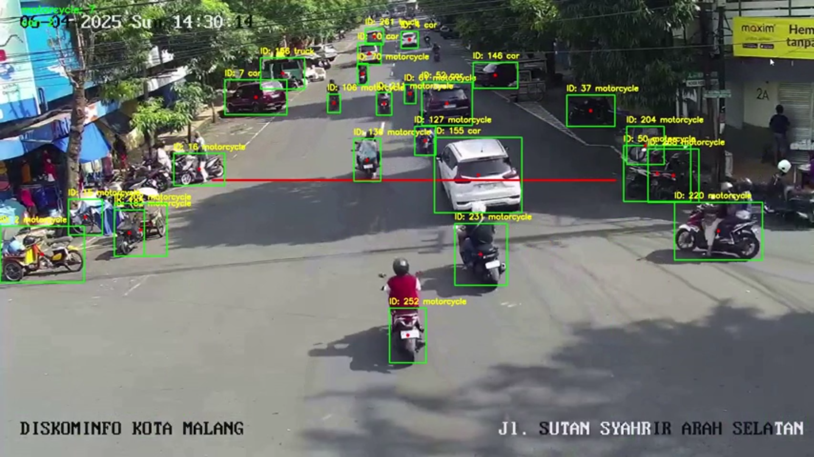

# YOLOv11 Vehicle Counting - Video & Live Stream

This project implements a vehicle detection and counting system based on YOLOv11. The application can detect and count vehicles from both uploaded videos and live streams.

---

## Dataset Description

The main dataset does not come from a static source, but rather from:
- Videos uploaded by users through a web interface.

Detection is performed using the pre-trained YOLOv11 model (`yolo11l.pt`) to recognize vehicles such as cars, motorcycles, buses, and trucks.

---

## Data Preprocessing

- Each video frame is converted into a NumPy array.
- The YOLOv11 model is used to detect objects in each frame.
- Tracking IDs are used to avoid duplicate counting of the same vehicle.
- Vehicles that cross the horizontal detection line are counted and recorded along with timestamp and confidence.

---

## Model Architecture Used

- **Model:** YOLOv11 (loaded from the file `yolo11l.pt`)
- **Framework:** Ultralytics YOLO (PyTorch-based)
- **Detected Classes:** Car, Motorcycle, Truck, Bus, etc. (classes 1, 2, 3, 5, 7)
- **Tracking:** Using the `track(persist=True)` feature from Ultralytics for per-object tracking IDs.

---

## Training Strategy

> No training is performed in this project. The YOLOv11 model used is a result of prior training (pretrained model) that is loaded directly through:
```python
model = YOLO('yolo11l.pt')
```
This model is already trained to detect common vehicles in urban environments.

---

## Model Evaluation

Evaluation is performed quantitatively through:
- **Number of vehicles counted automatically.**
- **Confidence score of each detection**, saved in a `.csv` file.

The CSV file contains:
- Total detected vehicles per type.
- Individual details: timestamp, vehicle ID, type, confidence.

Example:

| Timestamp           | Vehicle ID | Vehicle Type | Confidence |
|---------------------|------------|---------------|-------------|
| 2025-05-01 12:00:02 | 17         | car           | 0.88        |

---

## 📊 Performance Visualization

- Detection results are visualized directly on video frames:
  - Bounding box + label + ID
  - Red line as detection boundary
- The detection video can be played directly on the web interface.
- The number of vehicles per class is displayed in the UI.

Example visualization screenshot:



---

## 🌐 Web Interface

- The HTML file (`index.html`) provides a UI for:
  - Uploading and processing videos.
  - Displaying detection results.
  - Downloading the CSV file.
  - Live vehicle detection from streams.

---

## 📁 Project Structure

```
├── main.py              # FastAPI backend
├── index.html           # UI frontend
├── uploads/             # Folder for videos and detection results
├── csv_data/            # Folder for storing CSV files from detection
└── yolo11l.pt           # Pre-trained YOLO model
```

---

## 🚀 Running the Application

```bash
pip install fastapi uvicorn ultralytics opencv-python numpy
uvicorn main:app --reload --host 0.0.0.0 --port 8000
```

Access the UI at: [http://localhost:8000](http://localhost:8000)

---
